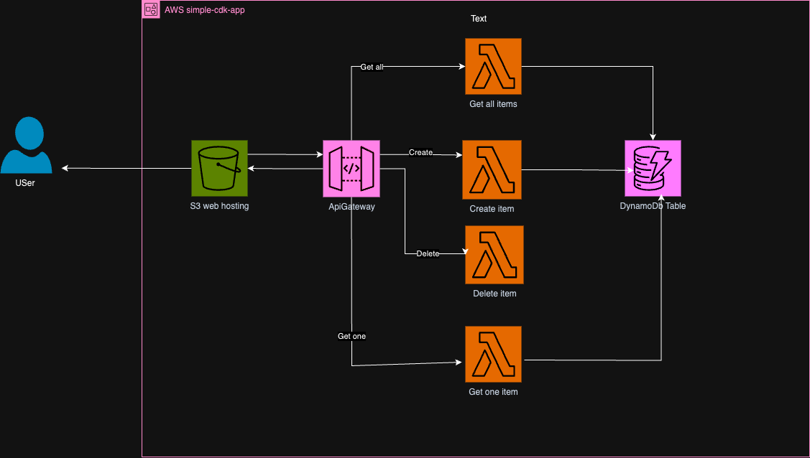

# About simple-cdk-app


This is React app hosted on AWS, which let's user to list/add/update and delete the items from inventory.


# Deployment stackset use following AWS services


- AWS Lambda

- AWS SNS

- AWS SystemManager parameterstore

- AWS IAM

- AWS DyanamoDB

- AWS APIGateway

- AWS S3 for application hosting


# The application has been developed using AWS CDK and following folders in the repo are as decsribed below

- apigateway - This folder contains the APIGateway constructs 

- client - This folder contains application source code

- configs -This folder contains configuration of all the construsts for AWS services

- deployment-bucket - This folder deploys s3 bucket which host's the react application

- dynamodb - This folder contains construct to create dynamodb table

- lambda_code - This folder contains source code for lambdas

- lambdas - This folder contains constructs to create lambda functions

- sns - This folder contains consturct to create a sns topic


# Tags 


Following tags have been applied on stackset level, and all the reources will inherit the tags when deployed


- Project

- Environment

- Application

- Sub-application


# Architecture details


- The code has been designed in individual modules to maximize reusability.

- All modules are independent and has separate configuration stored in configs file to avoid hardcoded values and enable parameterization approach.

- All the necessary outputs has been stored in parameter store which can be leveraged by other stacks.


# Applciation-link


http://simple-cdk-app-dev-s3-deployment-bucket.s3-website.ca-central-1.amazonaws.com/


# Below staks have been deployed 

- simple-cdk-app-dev-apigw

- simple-cdk-app-dev-s3-hosting-bucket

- simple-cdk-app-dev-dynamodb-table

- simple-cdk-app-dev-lambda-functions

- simple-cdk-app-dev-sns-notifications




# Welcome to your CDK Python project!

This is a blank project for CDK development with Python.

The `cdk.json` file tells the CDK Toolkit how to execute your app.

This project is set up like a standard Python project.  The initialization
process also creates a virtualenv within this project, stored under the `.venv`
directory.  To create the virtualenv it assumes that there is a `python3`
(or `python` for Windows) executable in your path with access to the `venv`
package. If for any reason the automatic creation of the virtualenv fails,
you can create the virtualenv manually.

To manually create a virtualenv on MacOS and Linux:

```
$ python3 -m venv .venv
```

After the init process completes and the virtualenv is created, you can use the following
step to activate your virtualenv.

```
$ source .venv/bin/activate
```

If you are a Windows platform, you would activate the virtualenv like this:

```
% .venv\Scripts\activate.bat
```

Once the virtualenv is activated, you can install the required dependencies.

```
$ pip install -r requirements.txt
```

At this point you can now synthesize the CloudFormation template for this code.

```
$ cdk synth
```

To add additional dependencies, for example other CDK libraries, just add
them to your `setup.py` file and rerun the `pip install -r requirements.txt`
command.

## Useful commands

 * `cdk ls`          list all stacks in the app
 * `cdk synth`       emits the synthesized CloudFormation template
 * `cdk deploy`      deploy this stack to your default AWS account/region
 * `cdk diff`        compare deployed stack with current state
 * `cdk docs`        open CDK documentation

Enjoy!
